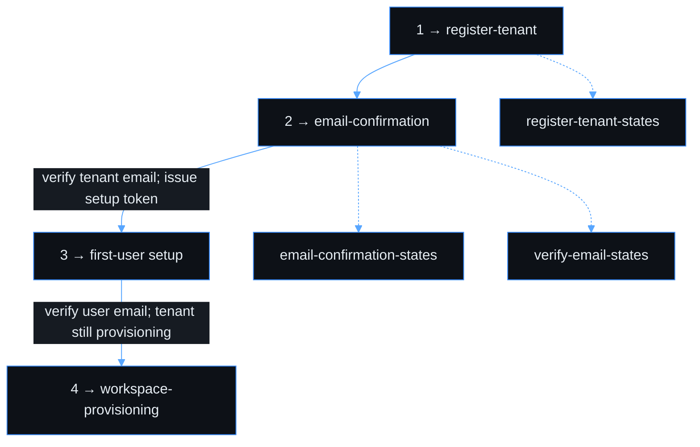
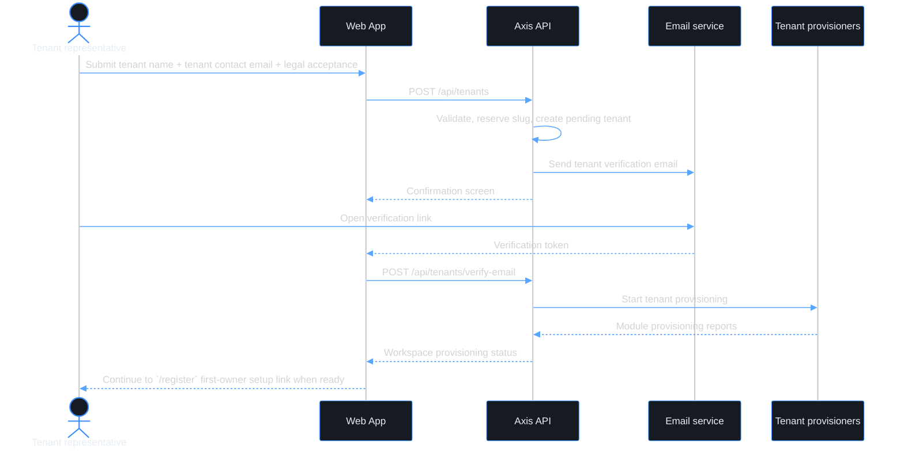
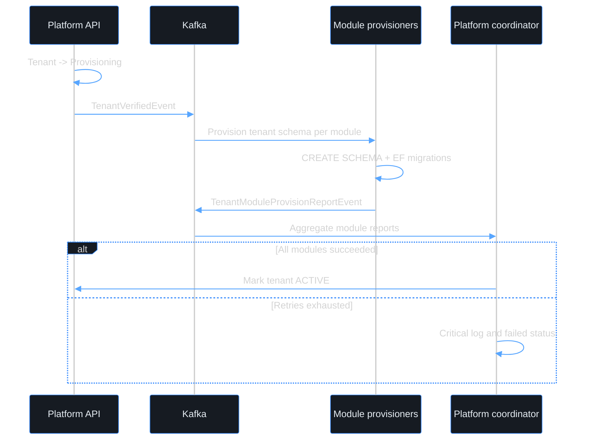

# Use case — Register a new tenant

> **Navigation**: [← Platform Foundation](../README.md) · [Use cases index](../README.md#use-cases)

## Purpose

Register a tenant on the Axis platform with an official tenant contact email, verify that contact channel, and provision the tenant foundation before any user identity is attached.

## Primary actor

- Tenant representative

## Trigger

- A prospective customer starts onboarding a new tenant.

## Main flow

1. Actor opens the tenant registration page.
2. Actor enters tenant name, tenant contact email, and accepts Terms of Service / Privacy Policy.
3. System validates the tenant details, reserves a unique tenant slug, and sends a verification email to the tenant contact email.
4. Actor verifies the tenant email link.
5. System marks the tenant verified, starts tenant provisioning, and issues a first-user setup link for the `/register` handoff.
6. Actor continues to user registration to create the first owner/admin identity.

## Alternate / error flows

- Tenant email already exists for another tenant: show the same confirmation screen where possible; never disclose ownership details to anonymous callers.
- Verification link expired: show a resend option for the tenant contact email.
- Verification link already used: show a clear completed-state message and link to user registration or sign-in.
- Provisioning fails after automatic retries: show the workspace provisioning failure state with manual retry/support action.

## Context

This use case is about tenant onboarding, not user identity onboarding. The email collected here is an official tenant contact email, such as `admin@company.com` or `it@company.com`; it is not a personal user login. Microsoft / Google / GitHub identity providers belong to user identity sign-in and provider-linking flows, not to tenant registration.

Axis supports standalone user accounts. Registering a tenant is required only when a user wants to create or join a tenant workspace; it is not a prerequisite for normal user registration.

## Acceptance Criteria

*Happy path*
- [ ] Registration form collects tenant name and tenant contact email.
- [ ] The user must accept the Terms of Service and Privacy Policy before the tenant registration can be submitted; the accepted versions are recorded with the tenant registration record.
- [ ] A tenant slug is auto-generated from the tenant name, uniqueness-checked, and shown to the actor before submission.
- [ ] On successful submission, a verification email is sent to the tenant contact email and the actor sees a confirmation screen.
- [ ] Clicking the verification link verifies the tenant contact email and starts tenant provisioning.
- [ ] After tenant verification, the system creates a short-lived first-user setup token/link for the `/register` handoff; the tenant is not usable until a user account is created and attached.
- [ ] Once tenant provisioning completes, the first registered owner/admin can access the workspace.

*Validation & errors*
- [ ] Tenant name: required, 2–100 characters.
- [ ] Tenant contact email: required, valid email format, unique across active tenants.
- [ ] Tenant contact email must not be collected from Microsoft / Google / GitHub OAuth claims in this use case.
- [ ] All field-level errors are shown inline, not as a global toast.
- [ ] Submitting with an already-registered tenant email shows the same confirmation screen when possible; anonymous callers must not learn whether a tenant already exists.
- [ ] If the API returns a server error (5xx), the form shows a generic "Something went wrong, please try again" message and the submit button re-enables.

*Edge cases*
- [ ] Multiple rapid submissions of the same tenant registration are deduplicated with an idempotency key.
- [ ] tenant name with special characters (e.g., `O'Brien & Co.`) is accepted and slugified consistently.
- [ ] A generic mailbox (e.g., `admin@company.com`) is allowed; the first-user setup link decides who becomes the initial owner/admin.
- [ ] Verification and first-user setup links are short-lived and single-use.

*Tenant provisioning*
- [ ] A dedicated PostgreSQL schema is created per module after tenant email verification.
- [ ] All base tables are migrated into each module's tenant schema automatically.
- [ ] Provisioning is idempotent: running it twice for the same tenant does not create duplicate schemas or tables.
- [ ] If a tenant schema already exists from a partial previous run, the migration runner continues from where it left off.
- [ ] The UI shows `workspace-provisioning` while tenant setup is running and redirects when the tenant becomes active.
- [ ] If provisioning fails after all retries, the UI shows a failed state with **Try again** and support contact.

*Out of scope*
- Standalone user registration without tenant context; see [register-user](../../identity-access/register-user/).
- User account provider linking and Microsoft / Google / GitHub login; see [sign-in](../../identity-access/sign-in/) and ADR-027.
- Enterprise SAML/SCIM federation and per-tenant IdP configuration.
- CAPTCHA / bot protection on the tenant registration form.
- Automatic re-send of verification email after X minutes.
- Custom schema naming chosen by the user; schema names are auto-generated.

> **Implementation status**
>
> | Layer | Status |
> |-------|--------|
> | Domain | ✅ |
> | Application | ✅ |
> | Infrastructure | ✅ |
> | API | ✅ |
> | Frontend | ⚠️ |
>
> **Gaps vs spec:** Backend/API now split tenant onboarding from standalone user registration.
> `POST /api/tenants` records tenant facts + legal versions and sends tenant-contact verification; it only creates the pending tenant record.
> The tenant-email verification step starts provisioning and issues a short-lived setup token for the `/register` first-owner handoff. Remaining work is the dedicated register-tenant frontend copy/validation and polished setup-token handoff UI.
>
> **Deferred follow-ups:**
> - Dedicated register-tenant frontend copy/validation.
> - Polished first-owner setup-token handoff UI.
>
> **Decisions:**
> - `register-tenant` owns tenant facts only: tenant name, tenant contact email, legal acceptance, slug, verification, and tenant provisioning.
> - Microsoft / Google / GitHub authenticate users, not tenants. Generic OAuth provider claims must not be used as proof that someone controls a tenant.
> - First owner/admin identity creation is a follow-up setup-token step after tenant verification.
> - Tenant onboarding is optional from the product perspective: a user can register and use Axis without creating or joining a tenant.
>
> **Gaps vs spec:**
> - N/A

## Screen flow

Canonical order for this use case. Screens owned by another use case are linked inline.

| Step | Screen | When |
|------|--------|------|
| 1 | `register-tenant` | Enter tenant name, tenant contact email, slug preview, and legal acceptance |
| 2 | `email-confirmation` | After tenant registration submit; tells actor to verify the tenant email |
| 3 | First-user setup handoff | First owner/admin uses the setup token and creates a user identity after tenant verification |
| 4 | `workspace-provisioning` | After user email verification when tenant setup is still running |

**Error / reference screens** (not sequential steps):

| Screen | When |
|--------|------|
| `register-tenant-states` | Validation or 5xx on the tenant registration form |
| `email-confirmation-states` | Resend tenant verification email: success and rate limit |
| `verify-email-states` | tenant email verification link expired, already used, invalid, or rate-limited |

## Wireframes

UI assets in this folder cover tenant-owned screens. Standalone user registration is owned by [register-user](../../identity-access/register-user/); external-provider/user-identity screens are not owned by this folder.

| # | Screen | Role | Excalidraw | Preview |
|---|--------|------|------------|---------|
| 1 | register-tenant | Happy path — tenant registration form | [source](./register-tenant.excalidraw) | [preview](./register-tenant.svg) |
| 2 | email-confirmation | Happy path — tenant email confirmation | [source](./email-confirmation.excalidraw) | [preview](./email-confirmation.svg) |
| 4 | workspace-provisioning | Tenant setup progress / failure reference | [source](./workspace-provisioning.excalidraw) | [preview](./workspace-provisioning.svg) |
| — | register-tenant-states | Validation / 5xx reference | [source](./register-tenant-states.excalidraw) | [preview](./register-tenant-states.svg) |
| — | email-confirmation-states | Resend tenant verification email states | [source](./email-confirmation-states.excalidraw) | [preview](./email-confirmation-states.svg) |
| — | verify-email-states | tenant verification link error states | [source](./verify-email-states.excalidraw) | [preview](./verify-email-states.svg) |

## Diagrams

### register-tenant-journey

Tenant onboarding only. First-owner identity setup continues through the setup-token `/register` handoff for users who are creating a tenant.

### tenant-provisioning

Async multi-module tenant setup after tenant email verification.

**Related:** [register-user](../../identity-access/register-user/) owns standalone user registration. First owner/admin setup-token polish remains part of this tenant onboarding journey; third-party identity providers belong to user identity sign-in/provider-linking flows.
