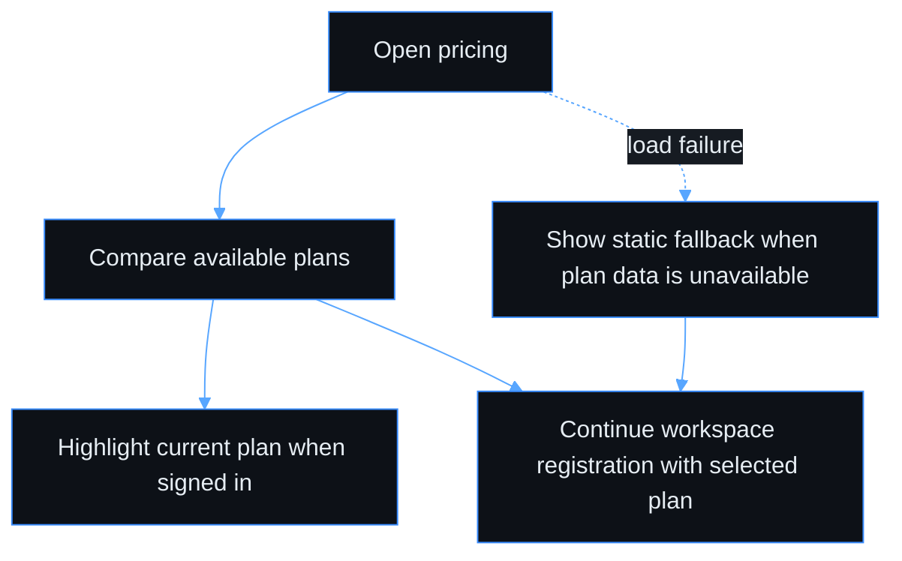

# Use case — View available plans

> **Navigation**: [← Platform Foundation](../README.md) · [Use cases index](../README.md#use-cases)

## Purpose

Compare available subscription plans so that I can choose the one that fits my needs.

## Primary actor

- Prospective customer (or signed-in workspace admin viewing pricing)

## Trigger

- User opens the public pricing page or plan comparison during signup.

## Main flow

1. Actor opens the public pricing page from the marketing entry point, onboarding entry point, or signup plan-selection step.
2. System presents the available plans in a side-by-side comparison on desktop and a stacked comparison on small screens.
3. Actor compares plan price, usage limits, and key feature availability.
4. Actor chooses a plan to continue into workspace registration, or returns to the current workspace if already signed in.
5. When the actor is a signed-in workspace admin, the current workspace plan is visually highlighted so the comparison has context.

## Alternate / error flows

- Plan information cannot be refreshed: show a static pricing fallback with a clear "Pricing may be outdated" notice.
- Signed-in context is unavailable or expired: show the public pricing experience without a current-plan badge.
- Current workspace is on a retired plan: keep that plan visible as the current plan for that workspace, but do not offer it to new signups.
- Actor opens pricing from signup without choosing a plan: registration can continue with the default free/trial plan.

## Context

This is a product-facing plan comparison experience. It helps prospective customers choose a plan before registration and helps signed-in workspace admins understand how their current plan compares to available options.

The page does not collect payment, change an existing workspace plan, or manage billing. Those belong to separate billing and admin plan-change flows.

## Acceptance Criteria

*Happy path*
- [ ] A public pricing page lists plans available to new customers with a side-by-side feature comparison table on desktop and a readable stacked layout on small screens.
- [ ] Each plan shows: name, monthly price (or "Free"), workflow limit, execution limit per month, user limit, storage limit, and key feature flags.
- [ ] Unlimited limits are shown in plain language rather than as an empty value.
- [ ] Each available plan has a clear call to action that continues the workspace registration journey with that plan selected.
- [ ] Signed-in workspace admins see their current plan highlighted with a "Current plan" badge.

*Validation & errors*
- [ ] If the pricing page fails to load plan data, it shows a static fallback with a "Pricing may be outdated" notice rather than a blank page.
- [ ] If the signed-in session cannot be confirmed, the page remains usable as public pricing and does not show a misleading current-plan badge.

*Edge cases*
- [ ] A plan that has been retired (no longer available for new signups) is not shown on the public pricing page but remains visible to existing workspaces still on that plan.
- [ ] When a signed-in workspace admin is on a retired plan, the plan is clearly marked as current but unavailable for new signups.

*Out of scope*
- Monthly vs annual billing toggle — part of the separate billing initiative.
- Per-seat pricing.
- Credit card collection and payment processing.
- Self-service upgrade/downgrade from this page; admin override is covered by [change workspace plan](../admin-change-plan/).

> **Implementation status**
>
> | Layer | Status |
> |-------|--------|
> | Domain | ✅ |
> | Application | ✅ |
> | Infrastructure | ✅ |
> | API | ✅ |
> | Frontend | ⏳ |
>
> **Gaps vs spec:** public pricing page UI, responsive comparison layout, signup plan-selection handoff, static fallback state, and current-plan badge.
>
> **Decisions:** pricing owns comparison and signup handoff only; billing, payment collection, and plan changes are separate flows. Retired plans are hidden for prospects but remain visible as current-plan context for existing workspaces.
>
> **Deferred follow-ups:**
> - N/A

## Screen flow

| Step | Screen / state | When |
|------|----------------|------|
| 1 | `pricing` | Actor compares available plans |
| 2 | `pricing-current-plan` | Signed-in workspace admin sees the current plan highlighted |
| 3 | `pricing-fallback` | Plan information cannot be refreshed |
| 4 | Workspace registration | Actor chooses a plan and continues onboarding |

## Wireframes

| Screen | Excalidraw | Preview |
|--------|------------|---------|
| pricing | [source](./pricing.excalidraw) | [preview](./pricing.svg) |
