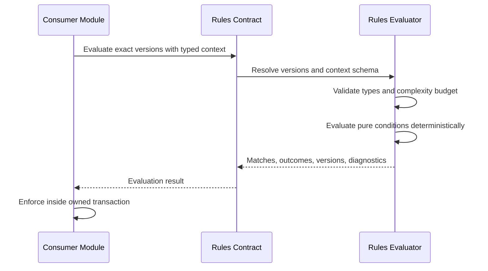

# Evaluate Published Rules

> **Navigation**: [docs/use-cases/rules/README.md](./README.md) · [docs/use-cases/README.md](../README.md) · [docs/README.md](../../README.md) · [AGENTS.md](../../../AGENTS.md)

## Purpose

Evaluate exact published system or workspace rule versions against typed context deterministically so product modules can enforce validation and decisions without embedding rule implementation details or transferring business-state ownership to Rules.

## Primary actor

- Product module evaluating an applied rule snapshot through the Rules public contract
- Signed-in workspace user simulating a workspace rule during authoring

## Trigger

- A consumer needs to evaluate one or more applied published rule versions before committing its own business transaction.
- User simulates a draft or published workspace rule with sample context.

## Main flow

1. Caller supplies workspace scope, evaluation purpose, scope context schema version, ordered rule references, canonical application parameters, and typed context.
2. Rules resolves every exact definition version and verifies availability for historical resolution, scope, outcome kind, and context-schema compatibility.
3. Rules validates parameter and context values against declared types and configured complexity limits.
4. Rules evaluates system and workspace expressions through one deterministic engine in rule order with short-circuit behavior defined by each logical group.
5. Validation evaluation returns all matched violations in deterministic order.
6. Decision evaluation returns Deny when any applicable matched rule denies, otherwise Allow; evaluation errors never become Allow.
7. Rules returns evaluated definition key/version, context schema version, match result, pure outcomes, and safe diagnostics without mutating consumer state.
8. Consumer decides whether to commit or reject its own transaction using the returned contract.

## Alternate / error flows

- Unknown or unresolved rule version: fail evaluation rather than substituting another version.
- Rule scope or context schema mismatch: fail with a stable compatibility error.
- Missing, malformed, oversized, or type-incompatible context or parameters: fail before condition evaluation.
- Archived definition referenced by an existing immutable snapshot: resolve the exact published version; archived definitions remain unavailable for new application.
- Complexity budget exceeded during evaluation: terminate safely and return an evaluation-limit error.
- Unexpected evaluator fault: return an evaluation failure with correlation metadata; never return a successful match, validation pass, or Allow decision.
- Cross-workspace workspace-rule reference or simulation: return not found without revealing definition existence.

## Acceptance Criteria

*Happy path*
- **AC-001** Evaluator accepts exact rule key/version references, application parameters, scope, context schema version, typed context, and evaluation purpose.
- **AC-002** System and workspace published versions carry versioned typed expressions and use the same deterministic expression evaluator while preserving origin and workspace isolation.
- **AC-003** The registered expression language supports typed equality, ordering, containment, text, null/presence, pure function calls, all, any, and not behavior only where declared type signatures allow it.
- **AC-004** Validation returns every matched violation with rule key/version, stable code, severity, and message in deterministic order.
- **AC-005** Decision evaluation returns Deny when any applicable matched rule denies and Allow only when evaluation completes successfully without a matched deny.
- **AC-006** Batch evaluation follows caller-supplied rule order with a stable secondary key/version order and produces the same output for equivalent canonical input.
- **AC-007** Simulation and readable rule details use the same canonical expression evaluated at runtime, simulation returns safe per-node diagnostics, and neither surface mutates rule or consumer business state.
- **AC-008** Archived published versions remain evaluable for existing immutable snapshots but cannot be newly applied.

*Validation & errors*
- **AC-009** Unknown language or capability versions, schema mismatches, invalid context paths, invalid types, missing parameters, and unsupported operators or functions fail with stable machine-readable errors.
- **AC-010** Evaluator enforces condition depth, node count, collection size, string size, numeric precision, and execution-step limits.
- **AC-011** Evaluation is pure and cannot access current time, randomness, environment variables, files, network services, arbitrary databases, reflection-based code execution, or side-effect services.
- **AC-012** Evaluation errors and unexpected faults never produce a successful validation pass or Allow decision.
- **AC-013** Calendar dates compare without timezone conversion; date-and-time values require explicit offsets and compare as canonical instants.
- **AC-014** Diagnostics redact context values by default and expose sample values only to the authorized simulation caller that supplied them.

*Edge cases*
- **AC-015** Workspace scope is required for workspace rule evaluation and simulation; cross-workspace rule references return a not-found style outcome.
- **AC-016** Rules owns resolution and pure evaluation; consumer modules own context construction, authorization, transaction boundaries, persistence, and enforcement behavior.
- **AC-017** Evaluation returns correlation metadata and exact versions sufficient for audit and support without persisting every execution inside the Rules transaction.
- **AC-018** Cancellation propagates through resolution and evaluation, stops further rule processing, and returns no partial success result.

## Acceptance Test Matrix

| ID | Boundary | Scenario | Covers AC | Verification | Required |
|---|---|---|---|---|---|
| AT-001 | Domain boundary | The shared typed-expression evaluator returns deterministic system and workspace matches for registered operators, pure functions, logical groups, and temporal semantics | AC-002, AC-003, AC-006, AC-013 | Domain test | Yes |
| AT-002 | Domain boundary | Limits, unsupported operations, type mismatches, and nondeterministic capabilities are rejected safely | AC-009, AC-010, AC-011, AC-012 | Domain test | Yes |
| AT-003 | Application boundary | Exact system/workspace expressions resolve through one evaluator and validation outcomes include every deterministic violation | AC-001, AC-002, AC-004, AC-006, AC-008, AC-017 | Application test | Yes |
| AT-004 | Application boundary | Decision aggregation denies safely, evaluation failures never allow, and cancellation returns no partial success | AC-005, AC-009, AC-012, AC-018 | Application test | Yes |
| AT-005 | API/Application boundaries | Simulation uses the runtime evaluator, returns redacted diagnostics, and performs no mutation | AC-007, AC-014, AC-016, AC-017 | Application test + API integration test | Yes |
| AT-006 | API boundary | Evaluation and simulation contracts expose stable problem codes, authorization behavior, and generated frontend parity | AC-001, AC-004, AC-005, AC-009, AC-014, AC-015 | API integration test | Yes |
| AT-007 | API/Application boundaries | Missing workspace, cross-workspace rule references, and unavailable definitions fail without disclosure | AC-002, AC-008, AC-015 | API integration test + Application test | Yes |
| AT-008 | Application boundary | Evaluator has no side-effect dependencies and consumers own authorization, persistence, and transaction enforcement | AC-011, AC-016 | Architecture test | Yes |
| AT-009 | UI component | Authoring simulation renders the returned match, non-match, diagnostic, and error states for valid and invalid sample context | AC-007 | UI component test | Yes |
| AT-010 | Browser journey | User simulates a workspace rule through the authoring flow without mutation, console errors, or layout overflow | AC-007, AC-014, AC-015 | Browser automation | Yes |

## Out Of Scope

- Persisting every runtime evaluation or building execution-history analytics.
- Consumer-specific record persistence, uniqueness queries, authorization state, workflow state mutation, or transaction rollback.
- Side-effect actions, external data providers, scripts, plugins, webhooks, and automation orchestration.
- Background scheduling, event consumption, inbox/outbox, or distributed rule execution.

## Screen flow

| Screen | Required contract |
|---|---|
| Rule authoring simulation | Accept bounded sample context, identify the selected scope schema, and run the same evaluator used at runtime. |
| Simulation result | Show match state, pure outcome, exact rule version, and safe node diagnostics without implying business state was changed. |
| Simulation error | Show stable contextual validation or evaluation failure without exposing secrets, stack traces, or unrelated workspace data. |

Required UI quality: simulation inputs and errors must be programmatically associated, keyboard reachable, bounded before submission, redacted by default, and responsive without document scrolling or horizontal overflow. Results must distinguish a non-match from evaluation failure and a successful Allow from an unevaluated state.

## Diagrams

### deterministic-rule-evaluation

> **Implementation status**
>
> | Layer | Status |
> |-------|--------|
> | Domain | Done |
> | Application | Done |
> | Infrastructure | Done |
> | API | Done |
> | Frontend | Done |
>
> **Gaps vs spec:** None.
>
> **Deferred follow-ups:** N/A. Consumer-specific enforcement and persisted execution analytics are separate ownership boundaries, not incomplete behavior in this use case.
>
> **Verification:** Acceptance proof is tracked in the sibling evidence sidecar.
>
> **Decisions:** Evaluation is deterministic, pure, bounded, side-effect free, and version exact. Rules owns one versioned typed-expression language, capability registry, and evaluator for system and workspace definitions. The system controls safe capabilities and type signatures while users control how capabilities available to their selected context are composed. Expressions are evaluated directly; no arbitrary parser, runtime code compilation, I/O, time, randomness, or side-effect capability is introduced. Validation collects all violations; Decision fails closed on matched deny or evaluator failure. Consumers own context, authorization, transactions, persistence, and enforcement. Archived versions remain resolvable only for existing snapshots. Execution-history storage, integration events, inbox/outbox, event sourcing, and distributed evaluation are rejected for this slice.
