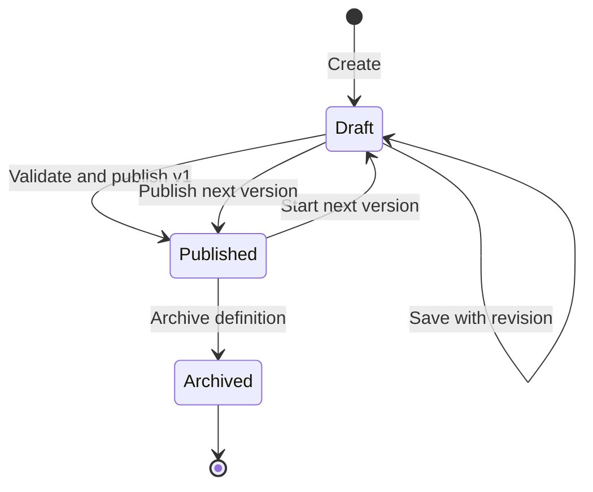
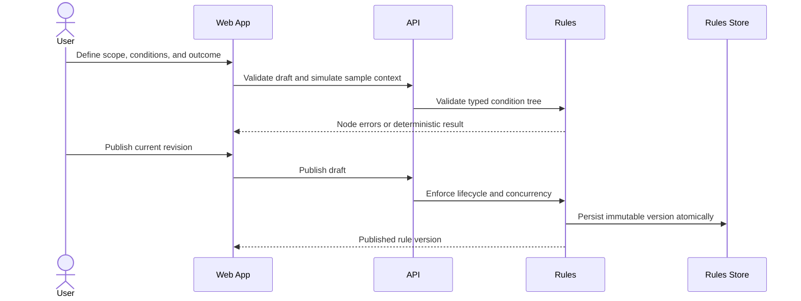

# Manage Workspace Rule Definitions

> **Navigation**: [docs/use-cases/rules/README.md](./README.md) · [docs/use-cases/README.md](../README.md) · [docs/README.md](../../README.md) · [AGENTS.md](../../../AGENTS.md)

## Purpose

Let a signed-in workspace user define, validate, publish, revise, and archive reusable workspace rules across supported system scopes without allowing arbitrary code or side-effect execution.

## Primary actor

- Signed-in workspace user

## Trigger

- User needs reusable business validation or decision behavior not supplied by the system catalog.
- User opens the Rules catalog and starts or revises a workspace-owned rule.

## Main flow

1. User opens the workspace Rules catalog containing system and workspace definitions.
2. User starts a workspace-owned draft with a name; system derives a stable workspace-unique rule key and displays it read-only after creation.
3. System offers the scopes exposed by context schemas currently registered by consumers.
4. User selects an available scope, context key, and schema version owned by the target business context.
5. User selects a pure outcome kind: Validation or Decision.
6. System exposes the context fields and typed operators registered for that scope and context version.
7. User builds a structured condition tree from context operands, literals, parameters, comparison operators, and all/any/not groups.
8. For Validation, user defines a stable violation code, severity, and user-facing message; for Decision, user defines Allow or Deny when the condition matches.
9. User validates the draft against the selected context contract and can simulate it with sample context before publication.
10. User publishes the current draft revision; system creates immutable version 1 and records publisher and publication time.
11. User can create a new draft revision from the latest published version and publish a later immutable version without changing earlier versions.
12. User can archive a workspace definition to prevent new application while preserving existing applied snapshots and historical version resolution.

## Alternate / error flows

- Duplicate or malformed rule key: reject creation without persistence.
- Unsupported scope, unavailable context key/schema version, outcome, operand, operator, or context path: reject draft validation and publication.
- Operand/operator type mismatch: identify the affected condition node and reject publication.
- Missing parameter schema, violation metadata, or decision outcome: reject publication.
- Condition tree exceeds configured depth, node, literal-size, or parameter limits: reject before persistence or evaluation.
- Stale draft revision or concurrent publication: reject without overwriting newer state or published versions.
- Archive requested for an already archived definition: return the current archived state without creating another version.
- Missing, unavailable, or cross-workspace scope: reject without mutation or resource disclosure.

## Acceptance Criteria

*Happy path*
- **AC-001** User can create a workspace-scoped draft rule with required name, server-derived stable key, description, scope, registered context key/schema version, and outcome kind.
- **AC-002** A workspace rule can be authored only for a currently registered context schema, and its scope must match that schema; supported outcomes are pure Validation and Decision outcomes.
- **AC-003** Conditions use a structured, typed tree with context, literal, and parameter operands plus comparison, all, any, and not operators; free-form executable code is not accepted.
- **AC-004** Consumer-owned context schemas and operator metadata are registered through Rules public contracts, identified by stable context key and positive schema version, and versioned independently from workspace business state.
- **AC-005** Validation outcomes carry stable violation code, severity, and message; Decision outcomes carry explicit Allow or Deny semantics.
- **AC-006** Draft validation returns node-specific errors and successful simulation returns the evaluated rule version, match result, and outcome without mutating business state.
- **AC-007** Publishing creates immutable version 1 with canonical condition, parameter schema, outcome, publisher, and publication time.
- **AC-008** Revising a published definition creates a new draft and later immutable version while all prior versions remain unchanged and resolvable.
- **AC-009** Archiving prevents new applications but preserves exact-version resolution for existing applied snapshots.
- **AC-010** Rules catalog lists system and current-workspace definitions with distinct origin, scope, lifecycle status, and latest version using deterministic ordering and pagination.

*Validation & errors*
- **AC-011** Rule keys are required, workspace unique, server derived, stable after creation, 1-63 characters, start with a lowercase letter, and contain lowercase letters, digits, and underscores.
- **AC-012** Names, descriptions, parameter keys, context paths, operators, condition groups, outcomes, and messages are validated before publication.
- **AC-013** Condition operands and operators must be type compatible with the selected context schema; unknown, unavailable, or stale context schema versions block publication.
- **AC-014** Configured limits for condition depth, nodes, literals, parameters, and simulation input are enforced before evaluation.
- **AC-015** Draft updates and publish operations require the caller's last-seen revision and reject stale writes without overwrite.
- **AC-016** Published versions are immutable; archive does not delete definition history or mutate applied consumer snapshots.
- **AC-017** Workspace rules cannot execute code, access files or network services, read secrets, query arbitrary databases, use nondeterministic time or randomness, or produce side effects.

*Edge cases*
- **AC-018** Current workspace scope is required for create, update, publish, archive, list, load, validate, and simulate operations.
- **AC-019** Workspace definitions and simulation inputs are isolated by workspace; cross-workspace access returns a not-found style result.
- **AC-020** Rules owns definition lifecycle, immutable versions, schemas, structured conditions, and pure outcomes; consumers own applications, business context, enforcement, and side effects outside Rules.
- **AC-021** Create, update, publish, and archive operations are atomic and record actor/time audit metadata for every lifecycle mutation.
- **AC-022** System definitions appear in the same catalog but remain read-only and cannot be revised, archived, or shadowed by a workspace key.

## Acceptance Test Matrix

| ID | Boundary | Scenario | Covers AC | Verification | Required |
|---|---|---|---|---|---|
| AT-001 | Domain boundary | Valid workspace rule lifecycle creates a stable draft, publishes immutable versions, revises, and archives without history mutation | AC-001, AC-007, AC-008, AC-009, AC-011, AC-016, AC-021 | Domain test | Yes |
| AT-002 | Domain boundary | Structured conditions and outcomes enforce supported scope values, typed operators, metadata, and complexity limits | AC-003, AC-005, AC-012, AC-013, AC-014, AC-017 | Domain test | Yes |
| AT-003 | Application boundary | Authoring enforces registered scope/context compatibility; draft validation and simulation return contextual results without business-state mutation | AC-002, AC-004, AC-006, AC-013, AC-014, AC-017, AC-020 | Application test | Yes |
| AT-004 | Application boundary | Stale update, concurrent publish, invalid archive, and system-definition mutation attempts fail safely | AC-015, AC-016, AC-021, AC-022 | Application test | Yes |
| AT-005 | Infrastructure boundary | Repository persists workspace isolation, immutable versions, audit metadata, concurrency, indexes, and atomic lifecycle changes | AC-007, AC-008, AC-009, AC-011, AC-015, AC-018, AC-019, AC-021 | Infrastructure integration test | Yes |
| AT-006 | API boundary | Authorized lifecycle endpoints expose stable request/response contracts, problem codes, pagination, and generated frontend parity | AC-001, AC-006, AC-007, AC-008, AC-009, AC-010, AC-011, AC-015 | API integration test | Yes |
| AT-007 | API/Application boundaries | Anonymous, missing-workspace, unavailable-workspace, and cross-workspace operations fail without mutation or disclosure | AC-018, AC-019, AC-022 | API integration test + Application test | Yes |
| AT-008 | Application boundary | Rules owns lifecycle/persistence and consumers depend only on context/evaluation contracts without internal-module references | AC-004, AC-017, AC-020 | Architecture test | Yes |
| AT-009 | UI component | Catalog and authoring surfaces support lifecycle, typed condition building, contextual errors, simulation, and read-only system definitions | AC-001, AC-002, AC-003, AC-005, AC-006, AC-010, AC-012, AC-014, AC-022 | UI component test | Yes |
| AT-010 | Browser journey | User creates, validates, simulates, publishes, revises, and archives a workspace rule without console errors or layout overflow | AC-001, AC-006, AC-007, AC-008, AC-009, AC-010, AC-018, AC-021 | Browser automation | Yes |

## Out Of Scope

- Side-effect actions, automation orchestration, notifications, webhooks, scripts, plugins, or arbitrary external data access.
- Editing or deleting immutable published versions.
- Using Rules as the owner of consumer records, object definitions, workflow state, permissions, or lifecycle transactions.
- Importing an unrestricted third-party expression language or accepting free-form executable expressions.

## Screen flow

| Screen | Required contract |
|---|---|
| Rules catalog | List system and workspace rules with useful scope, status, origin, and version context; provide creation only for workspace rules. |
| New rule identity | Capture name and description, display the derived stable key, and select a scope exposed by a registered context schema plus an outcome kind. |
| Condition builder | Build typed nested conditions using context-aware operands and operators without exposing raw serialized expressions. |
| Outcome editor | Configure Validation or Decision outcome details with contextual validation. |
| Validate and simulate | Show node-specific errors or deterministic result and outcome for sample context without mutation. |
| Publish review | Summarize scope, condition, parameters, outcome, and immutable version implications before publication. |
| Rule detail | Show lifecycle, latest version, audit metadata, prior immutable versions, revise action, and archive action where allowed. |

Required UI quality: authoring must be keyboard operable, preserve focus while nested conditions change, expose programmatic labels and node-specific errors, keep destructive archive implications visible, and remain usable without document scrolling or horizontal overflow. Raw AST, internal evaluator identifiers, secrets, and unbounded context payloads must not be rendered.

## Diagrams

### workspace-rule-lifecycle

### workspace-rule-publication

> **Implementation status**
>
> | Layer | Status |
> |-------|--------|
> | Domain | Done |
> | Application | Done |
> | Infrastructure | Done |
> | API | Done |
> | Frontend | Done |
>
> **Gaps vs spec:** None.
>
> **Deferred follow-ups:** N/A. Every in-scope behavior is represented by AC-001 through AC-022 and AT-001 through AT-010.
>
> **Verification:** Acceptance proof is tracked in the sibling evidence sidecar.
>
> **Decisions:** Workspace rules use structured typed conditions rather than free-form code. Definitions have draft/published/archived lifecycle with immutable published versions and optimistic concurrency. Workspace rules use only scopes exposed by registered context schemas and produce pure Validation or Decision outcomes. System rules share the catalog but remain code-owned and read-only. Consumers register versioned context schemas and own applications, enforcement transactions, and all side effects. Published versions are never edited or deleted. Event sourcing, integration events, inbox/outbox, scripting, plugins, and automation actions are rejected for this slice.
