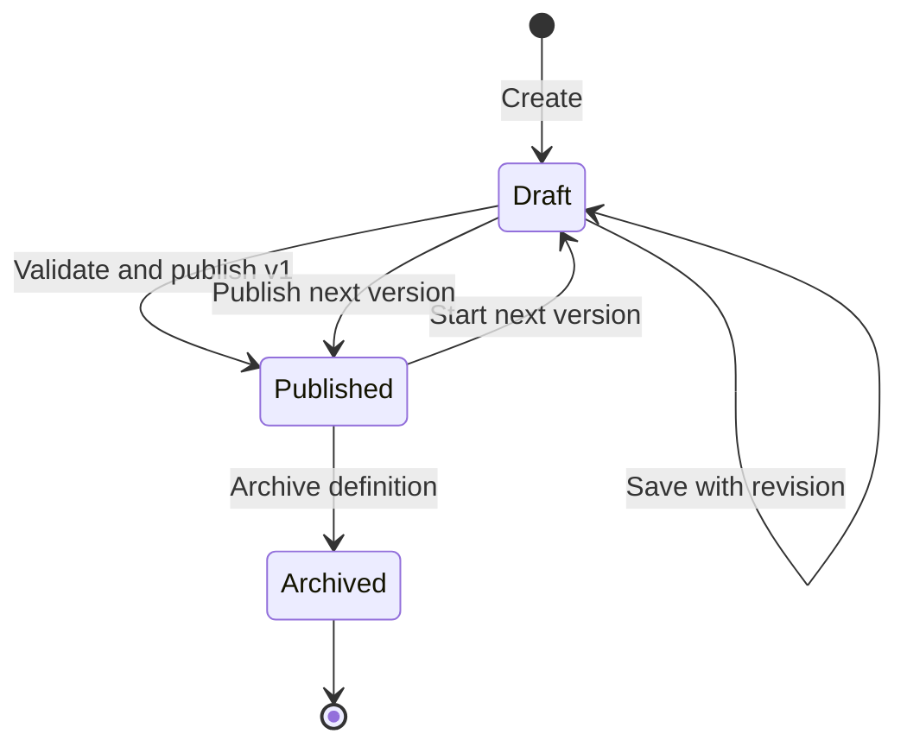
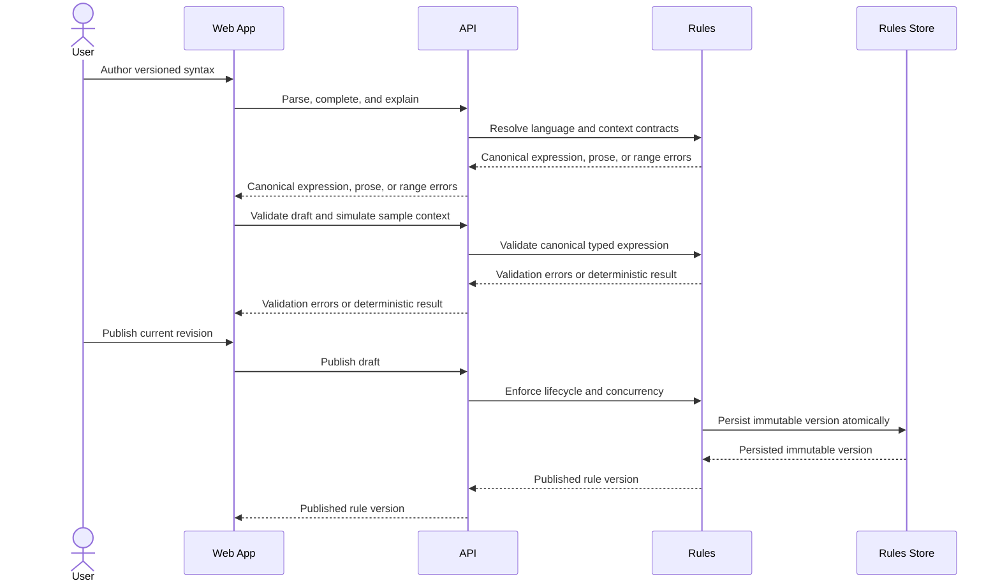

# Manage Workspace Rule Definitions

> **Navigation**: [docs/use-cases/rules/README.md](./README.md) · [docs/use-cases/README.md](../README.md) · [docs/README.md](../../README.md) · [AGENTS.md](../../../AGENTS.md)

## Purpose

Let a signed-in workspace user define, validate, publish, revise, and archive reusable workspace rules across supported system scopes without allowing arbitrary code or side-effect execution.

## Primary actor

- Signed-in workspace user

## Trigger

- User needs reusable business validation or decision behavior not supplied by the system catalog.
- User opens the Rules catalog and starts or revises a workspace-owned rule.

## Main flow

1. User opens the workspace Rules catalog containing system and workspace definitions.
2. User starts a workspace-owned draft with a name; system derives a stable workspace-unique rule key and displays it read-only after creation.
3. System offers the scopes exposed by context schemas currently registered by consumers.
4. User selects an available scope, context key, and schema version owned by the target business context.
5. User selects a pure outcome kind: Validation or Decision.
6. System combines the selected versioned expression-language capabilities with the fields supplied by the consumer-owned context schema registered for that scope and context version.
7. User independently composes a typed expression through a versioned, non-executable syntax editor. Autocomplete and the localized guide offer only context operands, literals, parameters, pure functions, comparison operators, and all/any/not groups allowed by the selected contracts.
8. As syntax changes, Rules parses it into the canonical typed expression and returns a synchronized localized natural-language preview. The user-authored syntax is never replaced by that preview.
9. For Validation, user defines a stable violation code, severity, and user-facing message; for Decision, user defines Allow or Deny when the expression matches.
10. User validates the draft against the selected context contract and can simulate it with sample context before publication.
11. User publishes the current draft revision; system creates immutable version 1 and records publisher and publication time.
12. User can create a new draft revision from the latest published version and publish a later immutable version without changing earlier versions.
13. User can archive a workspace definition to prevent new application while preserving existing applied snapshots and historical version resolution.

## Alternate / error flows

- Duplicate or malformed rule key: reject creation without persistence.
- Unsupported scope, unavailable context key/schema version, outcome, operand, operator, or context path: reject draft validation and publication.
- Operand/operator type mismatch: identify the affected expression node and reject publication.
- Missing parameter schema, violation metadata, or decision outcome: reject publication.
- Typed expression exceeds configured depth, node, literal-size, or parameter limits: reject before persistence or evaluation.
- Incomplete or invalid authoring syntax: keep the user's text, identify the affected source range, offer only valid completion candidates for the current contracts, and block save, simulation, and publication until parsing succeeds.
- Stale draft revision or concurrent publication: reject without overwriting newer state or published versions.
- Archive requested for an already archived definition: return the current archived state without creating another version.
- Missing, unavailable, or cross-workspace scope: reject without mutation or resource disclosure.

## Acceptance Criteria

*Happy path*
- **AC-001** User can create a workspace-scoped draft rule with required name, server-derived stable key, description, scope, registered context key/schema version, and outcome kind.
- **AC-002** A workspace rule can be authored only for a currently registered context schema, and its scope must match that schema; supported outcomes are pure Validation and Decision outcomes.
- **AC-003** Users can independently compose a typed expression through a versioned, non-executable syntax that covers every field, parameter, literal, operator, pure function, and logical group allowed by the selected context and expression-language version. Dynamic references use explicit namespaces: `@context.<path>` resolves only against the current server-provided context schema, and `@parameters.<key>` resolves only against the current rule parameter definitions. Unqualified, unknown, or mismatched references are rejected. Predefined templates and direct AST editing are not required, and arbitrary executable code is not accepted.
- **AC-004** Rules exposes one server-owned, versioned language contract for parsing, formatting, autocomplete, guide insertion, validation, and localized natural-language rendering. It includes stable typed signatures, syntax forms, localized reference metadata, and limits while consumer-owned context schemas expose available fields and their localized reference metadata independently from workspace business state.
- **AC-005** Validation outcomes carry stable violation code, severity, and message; Decision outcomes carry explicit Allow or Deny semantics.
- **AC-006** Authoring syntax validation preserves invalid input and returns stable machine-readable diagnostics with source ranges; successful parsing returns the canonical typed expression, canonical syntax, and localized natural-language projection, while successful simulation returns the evaluated rule version, match result, and outcome without mutating business state.
- **AC-007** Publishing creates immutable version 1 with the canonical expression and its language version, parameter schema, outcome, publisher, and publication time.
- **AC-008** Revising a published definition creates a new draft and later immutable version while all prior versions remain unchanged and resolvable.
- **AC-009** Archiving prevents new applications but preserves exact-version resolution for existing applied snapshots.
- **AC-010** Rules catalog searches and lists system and current-workspace definitions with distinct origin, scope, lifecycle status, and latest version using server-owned case-, diacritic-, order-, and typo-tolerant matching, deterministic relevance/default ordering, workspace isolation before ranking, and pagination.

*Validation & errors*
- **AC-011** Rule keys are required, workspace unique, server derived, stable after creation, 1-63 characters, start with a lowercase letter, and contain lowercase letters, digits, and underscores.
- **AC-012** Names, descriptions, parameter keys, context paths, operators, function calls, expression groups, outcomes, and messages are validated before publication.
- **AC-013** Expression operands, operators, and pure functions must be registered and type compatible with the selected context schema and language version; unknown, unavailable, or stale versions block publication.
- **AC-014** Configured limits for expression depth, nodes, function calls, literals, parameters, and simulation input are enforced before evaluation.
- **AC-015** Draft updates and publish operations require the caller's last-seen revision and reject stale writes without overwrite.
- **AC-016** Published versions are immutable; archive does not delete definition history or mutate applied consumer snapshots.
- **AC-017** Workspace rules cannot execute code, access files or network services, read secrets, query arbitrary databases, use nondeterministic time or randomness, or produce side effects.

*Edge cases*
- **AC-018** Current workspace scope is required for create, update, publish, archive, list, load, validate, and simulate operations.
- **AC-019** Workspace definitions and simulation inputs are isolated by workspace; cross-workspace access returns a not-found style result.
- **AC-020** Rules owns definition lifecycle, immutable versions, schemas, typed expressions, and pure outcomes; consumers own applications, business context, enforcement, and side effects outside Rules.
- **AC-021** Create, update, publish, and archive operations are atomic and record actor/time audit metadata for every lifecycle mutation.
- **AC-022** System definitions appear in the same catalog but remain read-only and cannot be revised, archived, or shadowed by a workspace key.
- **AC-023** Editable rule surfaces keep canonical syntax visible with context-aware autocomplete, keyboard acceptance, guide-to-editor insertion, and a synchronized natural-language preview. Completion and guide insertion emit the complete `@context.*` or `@parameters.*` reference; Enter accepts an active suggestion or creates a new line and never replaces syntax with prose.
- **AC-024** Read-only rule surfaces render every leaf as a localized sentence and every logical group as a semantic connector structure. A single serial path means every connected branch is required, split-and-rejoin parallel paths mean any connected branch may match, and an inversion node marks the exact branch or nested group whose result is negated. Logical operator words remain absent from the persistent presentation; each connector instead exposes its server-localized operator through a native hover title, keyboard-focusable accessible name, and exact-entry reference navigation. Indentation and connector scope retain every nested level. Natural presentation uses localized names rather than canonical namespace syntax, while reference typography distinguishes dynamic values from keywords. Canonical syntax, evaluator-only normalization details, and authoring controls remain omitted; changing locale changes natural presentation without changing canonical expression semantics or persisted versions.
- **AC-025** Every semantic expression term opens the same canonical server-generated expression document at that exact entry in both read and edit modes. The selected entry uses the exact localized phrase clicked as its heading, then presents concise server-owned meaning and usage guidance; examples, sibling context, enclosing groups, and raw occurrence syntax are excluded. Editable guide browsing may show examples after an item is found and exposes insertion actions. Technical reference content appears only when it explains the current search match. The server groups current context, parameters, groups, operators, functions, value types, and limits into localized sections. Server search uses names, stable syntax/reference keys, meaning, usage guidance, and technical reference content, but never examples; it ranks case-, diacritic-, and order-insensitive matches, tolerates minor spelling errors, returns structured original-text highlights, and reports no-result state without requiring exact substrings.

## Acceptance Test Matrix

| ID | Boundary | Scenario | Covers AC | Verification | Required |
|---|---|---|---|---|---|
| AT-001 | Domain boundary | Valid workspace rule lifecycle creates a stable draft, publishes immutable versions, revises, and archives without history mutation | AC-001, AC-007, AC-008, AC-009, AC-011, AC-016, AC-021 | Domain test | Yes |
| AT-002 | Domain boundary | Typed expressions and outcomes enforce registered operators and pure functions, type signatures, supported scope values, metadata, and complexity limits | AC-003, AC-005, AC-012, AC-013, AC-014, AC-017 | Domain test | Yes |
| AT-003 | Application boundary | One versioned language service parses and formats namespaced syntax, returns context-aware completions, canonical typed expressions, source-range diagnostics, and localized natural-language projections while enforcing context/language compatibility without business-state mutation | AC-002, AC-003, AC-004, AC-006, AC-013, AC-014, AC-017, AC-020, AC-024 | Application test | Yes |
| AT-004 | Application boundary | Stale update, concurrent publish, invalid archive, and system-definition mutation attempts fail safely | AC-015, AC-016, AC-021, AC-022 | Application test | Yes |
| AT-005 | Infrastructure boundary | Repository persists workspace isolation, immutable versions, audit metadata, concurrency, indexed search, and atomic lifecycle changes | AC-007, AC-008, AC-009, AC-010, AC-011, AC-015, AC-018, AC-019, AC-021 | Infrastructure integration test | Yes |
| AT-006 | API boundary | Authorized lifecycle, catalog-search, and language-service endpoints expose stable request/response contracts, server-generated reference documents, structured highlights, diagnostics, projections, problem codes, pagination, and generated frontend parity | AC-001, AC-004, AC-006, AC-007, AC-008, AC-009, AC-010, AC-011, AC-015, AC-024, AC-025 | API integration test | Yes |
| AT-007 | API/Application boundaries | Anonymous, missing-workspace, unavailable-workspace, and cross-workspace operations fail without mutation or disclosure | AC-018, AC-019, AC-022 | API integration test + Application test | Yes |
| AT-008 | Application boundary | Rules owns lifecycle/persistence and consumers depend only on context/evaluation contracts without internal-module references | AC-004, AC-017, AC-020 | Architecture test | Yes |
| AT-009 | UI component | Authoring keeps namespaced syntax and localized prose synchronized, supports keyboard autocomplete and document insertion, preserves invalid text with range diagnostics, and every read/edit semantic reference opens the same grouped document at its exact entry with the clicked phrase, concise meaning, usage guidance, ranked fuzzy search, and highlighted matches without examples, raw occurrence syntax, or unrelated context; editable guide browsing retains examples after discovery | AC-001, AC-002, AC-003, AC-004, AC-005, AC-006, AC-010, AC-012, AC-022, AC-023, AC-024, AC-025 | UI component test | Yes |
| AT-010 | Browser journey | User searches and navigates the canonical expression document, inserts namespaced syntax, sees synchronized prose, validates, simulates, publishes, revises, and archives a workspace rule without console errors or layout overflow | AC-001, AC-003, AC-006, AC-007, AC-008, AC-009, AC-010, AC-018, AC-021, AC-023, AC-025 | Browser automation | Yes |

## Out Of Scope

- Side-effect actions, automation orchestration, notifications, webhooks, scripts, plugins, or arbitrary external data access.
- Editing or deleting immutable published versions.
- Using Rules as the owner of consumer records, object definitions, workflow state, permissions, or lifecycle transactions.
- Importing an unrestricted third-party expression language or accepting free-form executable expressions.

## Screen flow

| Screen | Required contract |
|---|---|
| Rules catalog | List system and workspace rules with useful scope, status, origin, and version context; render each origin with a distinct, stable semantic badge treatment and provide creation only for workspace rules. |
| New rule identity | Capture name and description, display the derived stable key, and select a scope exposed by a registered context schema plus an outcome kind. |
| Expression editor | Keep canonical syntax as the editable source while a synchronized localized natural-language preview explains the same server-parsed expression below it. Use `@context.<path>` for runtime context and `@parameters.<key>` for rule configuration, resolving each from the selected server-provided contracts with no client-owned reference list. Offer context-aware autocomplete and the canonical grouped expression document generated from those contracts; entries insert their complete namespaced syntax at the current cursor. Preserve invalid text, mark exact error ranges, and block expression-dependent mutations until parsing succeeds. Enter accepts the active suggestion or creates a new line; it never converts syntax into prose. Do not expose raw serialized AST data or maintain frontend capability, syntax, or documentation maps. |
| Outcome editor | Configure Validation or Decision outcome details with contextual validation. |
| Validate and simulate | Show node-specific errors or deterministic result and outcome for sample context without mutation. |
| Publish review | Before mutation, summarize scope, context, parameters, the complete When → Then behavior and effect, and immutable version implications. |
| Rule detail | Present published or archived definitions as semantic read-only content: a vertical When → Then behavior whose leaves are server-rendered localized sentences and whose logical groups use semantic connector structures, followed by visible effect, applicability, parameters, references, audit metadata, and prior immutable versions, with revise and archive actions where allowed. Keep every leaf on its own row. Use one serial path for `and`, split-and-rejoin parallel paths for `or`, and an inversion node before the exact branch or nested group for `not`; preserve every nested level through indentation and connector scope without persistently rendering operator words. Make each connector keyboard-focusable, expose its server-localized operator through native hover title and accessible name, and open the canonical expression document at that exact operator entry. Use localized natural names and reference typography rather than canonical namespace syntax. Omit evaluator-only normalization details, canonical syntax, and authoring controls. Make semantic terms visibly keyboard-actionable and open the canonical expression document at the exact server-derived context, parameter, capability, type, or limit entry without insertion actions. |

Required UI quality: authoring and expression guidance must be keyboard operable, preserve cursor and focus while suggestions or the expression document opens, expose programmatic labels and source-range errors, keep syntax and prose visually distinct, align every connector with the center of its condition row, keep nested split/rejoin scope visually closed, keep destructive archive implications visible, and remain usable without document scrolling or horizontal overflow. Connector controls must preserve focus indication and expose the same localized meaning through native hover title and accessible name without adding persistent operator labels. One capability-derived document serves read and edit modes, scrolls and focuses the selected entry, uses the clicked server-provided phrase as its heading, and leads with concise meaning and usage. Direct reference navigation omits examples; editable guide browsing may show them after discovery and exposes insertion actions. Technical reference content appears only when it contains a highlighted search match. Search must exclude examples, rank approximate multi-term matches across owned searchable fields, ignore case and diacritics, highlight matching text, and expose a clear no-result state. Raw occurrence syntax, raw AST, sibling condition details, internal evaluator identifiers, secrets, and unbounded context payloads must not be rendered.

## Diagrams

### workspace-rule-lifecycle

```mermaid
stateDiagram-v2
  [*] --> Draft: Create
  Draft --> Published: Validate and publish v1
  Draft --> Draft: Save with revision
  Published --> Draft: Start next version
  Draft --> Published: Publish next version
  Published --> Archived: Archive definition
  Archived --> [*]
```

### workspace-rule-publication

```mermaid
sequenceDiagram
  actor User
  participant Web as Web App
  participant API as API
  participant Rules as Rules
  participant Store as Rules Store

  User->>Web: Author versioned syntax
  Web->>API: Parse, complete, and explain
  API->>Rules: Resolve language and context contracts
  Rules-->>API: Canonical expression, prose, or range errors
  API-->>Web: Canonical expression, prose, or range errors
  Web->>API: Validate draft and simulate sample context
  API->>Rules: Validate canonical typed expression
  Rules-->>API: Validation errors or deterministic result
  API-->>Web: Validation errors or deterministic result
  User->>Web: Publish current revision
  Web->>API: Publish draft
  API->>Rules: Enforce lifecycle and concurrency
  Rules->>Store: Persist immutable version atomically
  Store-->>Rules: Persisted immutable version
  Rules-->>API: Published rule version
  API-->>Web: Published rule version
```

> **Implementation status**
>
> | Layer | Status |
> |-------|--------|
> | Domain | Done |
> | Application | Partial |
> | Infrastructure | Partial |
> | API | Partial |
> | Frontend | Partial |
>
> **Gaps vs spec:** No known gap in the implemented AC-010 and AC-025 search and expression-document slice; remaining partial layers retain their existing non-search scope.
>
> **Deferred follow-ups:** N/A. Alternative read-store adapters and global search remain outside this use case.
>
> **Verification:** Acceptance proof is tracked in the sibling evidence sidecar.
>
> **Decisions:** Rules owns one versioned typed-expression language and one evaluator for system and workspace definitions. The canonical AST remains the persisted and evaluated source of truth. The approved authoring syntax is a stable, locale-independent, non-executable projection parsed by Rules; localized natural language is a server-rendered explanation and is never persisted as semantics. `@context.*` and `@parameters.*` are the only dynamic-reference namespaces; Rules resolves each namespace from its matching current server contract and rejects unqualified, unknown, or mismatched names. One server registry owns parsing, formatting, completion, document composition, insertion metadata, diagnostics, localized rendering, matching, ranking, and structured highlights so client maps cannot drift. Read-only references deep-link into that canonical server document, while edit mode adds insertion actions. Consumers register versioned context schemas and control available field references; users control composition. Search follows [docs/playbooks/search.md](../../playbooks/search.md), with PostgreSQL as the first provider behind a storage-neutral Application port. The high-risk public-contract, schema, and search replacement was explicitly approved on 2026-07-25. The structured-builder save shape, unqualified `@` syntax, focused reference dialog, and client search matcher are retired without compatibility shims. Definitions retain draft/published/archived lifecycle, immutable published versions, and optimistic concurrency. Runtime scripting, plugins, arbitrary executable code, and side effects remain rejected.
