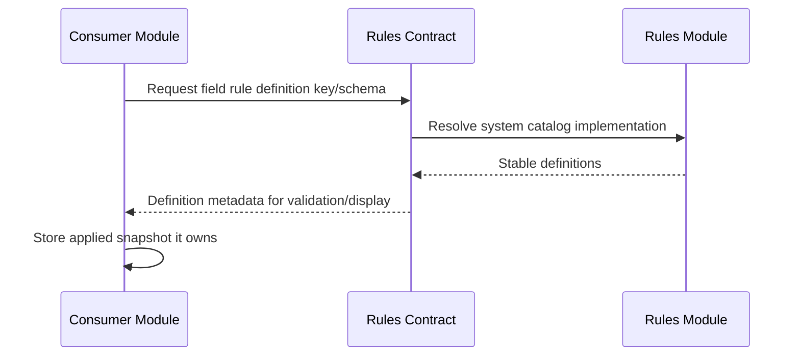

# Provide System Field Rule Definitions

> **Navigation**: [docs/use-cases/rules/README.md](./README.md) · [docs/use-cases/README.md](../README.md) · [docs/README.md](../../README.md) · [AGENTS.md](../../../AGENTS.md)

## Purpose

Provide a stable, read-only catalog of system field rule definitions so product modules can configure applied field rules without hard-coding rule-specific enums, DTO fields, or database columns.

## Primary actor

- Signed-in workspace user through a product surface that configures field rules
- Signed-in workspace user reviewing the system-managed Rules catalog

## Trigger

- A product surface needs to list field rule definitions and parameter schemas.
- A module validates an applied field rule against a system definition key.

## Main flow

1. User opens a product surface that supports field rules.
2. System loads the system field rule catalog.
3. Rules returns deterministic field rule definitions with stable keys, display metadata, supported field type identifiers, and parameter schemas.
4. The product surface shows compatible rule controls for the selected field type.
5. The consuming module stores only the applied rule snapshot it owns.
6. User can open the Rules catalog from authenticated module navigation to review built-in field rule definitions, supported field types, parameter schemas, and read-only status.

## Alternate / error flows

- Unknown definition key: consuming module rejects the applied rule without persistence.
- Definition incompatible with the consumer's selected field type: consuming module rejects the applied rule without persistence.
- Missing or malformed parameter: consuming module rejects the applied rule without persistence.

## Acceptance Criteria

*Happy path*
- **AC-001** Rules exposes a deterministic read-only catalog of system field rule definitions.
- **AC-002** Each definition has a stable definition key, display name, description, supported field type identifiers, and parameter schema.
- **AC-003** The first system definitions are `field.required`, `field.numeric_range`, `field.date_range`, `field.text_length`, `field.text_pattern`, and `field.single_select_options`.
- **AC-004** Parameter schemas support scalar and multi-value canonical string values with declared parameter types so consumers can validate applied rule parameters consistently.
- **AC-005** Consumers can reference Rules through the approved public contract without depending on Rules Domain, Application internals, Infrastructure, or persistence details.

*Validation & errors*
- **AC-006** Definition keys and parameter keys are normalized, unique, and stable.
- **AC-007** The catalog rejects invalid system definition metadata in tests before runtime.
- **AC-008** Unknown rule definition keys are not treated as valid system definitions.

*Edge cases*
- **AC-009** This use case does not create user-authored custom rules, expression DSLs, object-level rules, workflow/lifecycle rules, permissions, automations, integrations, or side-effect actions.
- **AC-010** This use case does not evaluate business object record values; evaluation belongs to a later record-validation use case.
- **AC-011** Rules owns reusable definitions and schemas; consuming modules own applied snapshots and their own workspace-scoped state.

## Acceptance Test Matrix

| ID | Boundary | Scenario | Covers AC | Verification | Required |
|---|---|---|---|---|---|
| AT-001 | Domain boundary | System field rule catalog returns stable definitions with normalized unique keys, supported field types, and parameter schemas | AC-001, AC-002, AC-003, AC-006, AC-007 | Domain test | Yes |
| AT-002 | Application boundary | Listing field rule definitions returns deterministic contract DTOs without mutation or persistence | AC-001, AC-002, AC-004, AC-008 | Application test | Yes |
| AT-003 | API boundary | Rules catalog endpoint exposes only read-only system field rule definitions and no custom authoring, expression, workflow, automation, or integration artifacts | AC-001, AC-002, AC-003, AC-009, AC-010 | API integration test | Yes |
| AT-004 | Domain boundary | Consumers depend only on the approved Rules public contract while Rules internals remain isolated | AC-005, AC-011 | Architecture test | Yes |
| AT-005 | UI component | Authenticated module navigation exposes Rules and the Rules catalog shows built-in field rule definitions, supported field types, parameter schemas, and read-only status without custom authoring actions | AC-001, AC-002, AC-003, AC-004, AC-009 | UI component test | Yes |

## Out Of Scope

- User-authored custom rules or rule-definition CRUD.
- Expression parsing, expression evaluation, formulas, computed fields, or record-value evaluation.
- Object lifecycle rules, workflow states, permissions, automations, integrations, webhooks, or side-effect actions.
- Rule execution history, audit trails, approval workflows, or publishing custom rule versions.

## Screen flow

| Screen | Required contract |
|---|---|
| Authenticated module navigation | Show Rules as a first-class workspace module beside Objects. |
| Rules catalog | Show built-in system field rule definitions with stable definition keys, localized display labels, supported field types, parameter schemas, and read-only/system-managed status. |
| Business object field editor | Load the Rules catalog and show compatible system field rules for the selected field type before storing applied snapshots owned by Objects. |

## Diagrams

### system-field-rule-catalog

> **Implementation status**
>
> | Layer | Status |
> |-------|--------|
> | Domain | Done |
> | Application | Done |
> | Infrastructure | Done |
> | API | Done |
> | Frontend | Done |
>
> **Gaps vs spec:** N/A.
>
> **Deferred follow-ups:** N/A for this use case. Custom rule authoring and runtime record evaluation remain separate out-of-scope use cases.
>
> **Verification:** [docs/use-cases/rules/provide-system-field-rule-definitions.evidence.md](./provide-system-field-rule-definitions.evidence.md).
>
> **Decisions:** Rules starts with a read-only system field rule catalog because current product behavior needs stable reusable definitions before custom authoring. Definition metadata is module-owned product behavior, not shared-kernel behavior. Consumers store applied snapshots they own and may not depend on Rules Domain, Application internals, Infrastructure, or persistence details.
