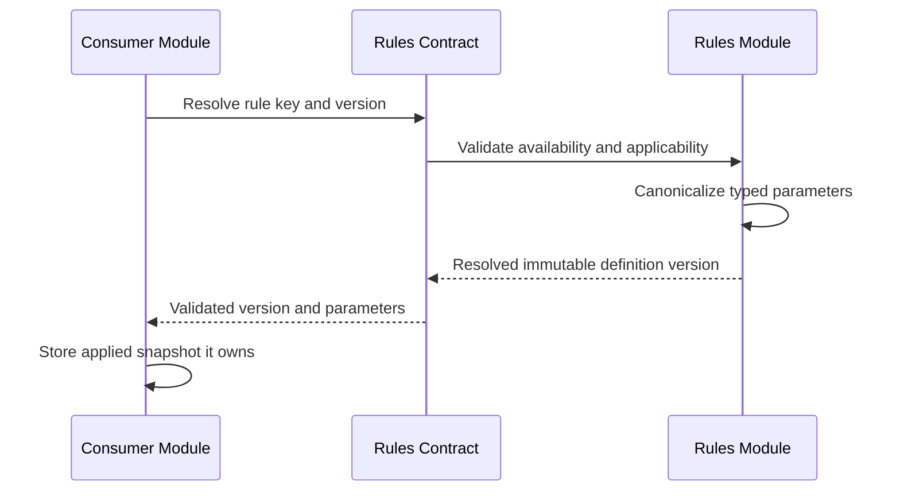

# Provide System Field Rule Definitions

> **Navigation**: [docs/use-cases/rules/README.md](./README.md) · [docs/use-cases/README.md](../README.md) · [docs/README.md](../../README.md) · [AGENTS.md](../../../AGENTS.md)

## Purpose

Provide a stable, versioned catalog of enterprise system field-rule definitions so product modules can discover compatible validation behavior without hard-coding rule-specific enums, DTO fields, or persistence columns.

## Primary actor

- Signed-in workspace user through a product surface that configures field rules
- Signed-in workspace user reviewing the Rules catalog

## Trigger

- A product surface needs compatible system field-rule definitions and parameter schemas.
- A consumer validates or snapshots an applied system rule version.
- User reviews the system-managed Rules catalog.

## Main flow

1. Consumer requests the system field-rule catalog.
2. Rules returns deterministic published definitions with stable keys, immutable versions, origin, scope, descriptions, applicability metadata, typed parameter schemas, and expressions built from the same versioned capabilities available to workspace rules.
3. Consumer filters definitions against its target field type and type configuration.
4. User configures an applicable rule through the consumer-owned product surface.
5. Rules validates the requested definition version, applicability, and canonical parameter values.
6. Consumer stores the applied rule version and parameters in its owning business state.
7. User can review the system definitions in the Rules catalog without receiving mutation controls.

## Alternate / error flows

- Unknown definition key or version: reject the applied rule without persistence.
- Unpublished or archived version: reject new application while preserving existing immutable snapshots.
- Definition incompatible with field type or type configuration: reject without persistence.
- Missing, malformed, unsupported, or non-canonical parameter: reject with a parameter-specific error.
- Invalid system catalog metadata: fail deterministic catalog tests before runtime.

## Acceptance Criteria

*Happy path*
- **AC-001** Rules exposes a deterministic read-only catalog of published system field-rule definitions.
- **AC-002** Each definition exposes a stable key, immutable positive version, display metadata, `System` origin, `Field` scope, applicability metadata, parameter schema, outcome, and a typed expression with an explicit language version.
- **AC-003** The baseline catalog includes required value, numeric range, decimal precision, calendar-date range, date-and-time range, text length, text pattern, text format, and choice selection count.
- **AC-004** Applicability distinguishes Text, Integer, Decimal, Date, DateTime, Boolean, and Choice and can constrain compatible Choice selection mode.
- **AC-005** Parameter schemas support canonical text, integer, decimal, date, date-and-time, boolean, and multi-value values plus declared allowed values where required.
- **AC-006** Consumers can resolve and validate an exact published rule version, including its executable typed expression, through the Rules public contract without depending on Rules internals.
- **AC-007** Existing applied snapshots remain resolvable by key and version after newer system versions are published or a version is retired from new application.

*Validation & errors*
- **AC-008** Definition keys, versions, parameter keys, applicability metadata, and allowed values are normalized, unique, and stable.
- **AC-009** Catalog construction rejects missing metadata, invalid applicability, duplicate definitions or versions, and invalid parameter schemas before runtime.
- **AC-010** Unknown, unpublished, archived, or incompatible rule versions are never treated as valid for new application.
- **AC-011** Date parameters use calendar-date semantics and DateTime parameters require an explicit offset before canonical UTC normalization.
- **AC-012** System field rules use the shared expression evaluator, are deterministic, and cannot execute arbitrary code, external I/O, side effects, current time, or randomness.

*Edge cases*
- **AC-013** The system catalog is global read-only metadata; workspace-authored definitions are workspace isolated and owned by the workspace-rule use case.
- **AC-014** Rules owns definition metadata, version resolution, schemas, applicability, and configuration validation; consumers own applied snapshots and runtime business state.
- **AC-015** Removing a rule from new application does not mutate immutable published consumer snapshots that reference an older resolvable version.

## Acceptance Test Matrix

| ID | Boundary | Scenario | Covers AC | Verification | Required |
|---|---|---|---|---|---|
| AT-001 | Domain boundary | Catalog returns the complete normalized baseline with stable keys, versions, applicability, schemas, outcomes, and valid versioned expressions | AC-001, AC-002, AC-003, AC-004, AC-005, AC-008, AC-009 | Domain test | Yes |
| AT-002 | Application boundary | Exact versions resolve deterministically and valid parameters canonicalize without mutation | AC-006, AC-007, AC-011, AC-014, AC-015 | Application test | Yes |
| AT-003 | Application boundary | System expressions run through the shared evaluator and unknown, unavailable, incompatible, malformed, and nondeterministic applications are rejected | AC-010, AC-011, AC-012 | Application test | Yes |
| AT-004 | API boundary | Authenticated catalog and detail responses expose versioned system metadata, expressions, outcomes, and capability references with generated frontend parity and no mutation surface | AC-001, AC-002, AC-003, AC-005, AC-013 | API integration test | Yes |
| AT-005 | Application boundary | Consumers reference Rules contracts only and Rules remains free of consumer state or side-effect dependencies | AC-006, AC-012, AC-014 | Architecture test | Yes |
| AT-006 | UI component | Rules catalog presents system rules, applicability, setup summary, lifecycle, and the same readable expression that runtime evaluates without system mutation controls | AC-001, AC-002, AC-003, AC-004, AC-013 | UI component test | Yes |

## Out Of Scope

- Workspace-authored rule lifecycle, owned by [docs/use-cases/rules/manage-workspace-rule-definitions.md](./manage-workspace-rule-definitions.md).
- Runtime and simulation evaluation, owned by [docs/use-cases/rules/evaluate-published-rules.md](./evaluate-published-rules.md).
- Record persistence, uniqueness queries, external option providers, side-effect actions, webhooks, and automation execution.

## Screen flow

| Screen | Required contract |
|---|---|
| Rules catalog | Show system rules in the shared catalog with scope, applicability, concise setup summary, read-only behavior, and an entry point to definition details. |
| System rule details | Keep the rule name with separate Built-in origin and Published lifecycle badges in the dialog header, using the same stable semantic treatments as the catalog. Present overview, supported-field, readable rule-logic, parameter, and outcome information as clear sections; the rule-logic section renders the same typed expression that runtime evaluates rather than a frontend-authored description. Give each section a heading, place labeled values in a consistent label/content structure, and use a subtle divider between sections. |
| Consumer field editor | Show only rules compatible with the selected field type and configuration and snapshot the selected version. |

Required UI quality: catalog rows must remain scannable as definitions grow, avoid exposing internal evaluator keys or raw schema payloads, and preserve keyboard navigation, responsive scrolling, localized labels, and visible loading, empty, and error states.

## Diagrams

### versioned-system-rule-resolution

> **Implementation status**
>
> | Layer | Status |
> |-------|--------|
> | Domain | Done |
> | Application | Done |
> | Infrastructure | N/A |
> | API | Done |
> | Frontend | Done |
>
> **Gaps vs spec:** None.
>
> **Deferred follow-ups:** N/A. Workspace authoring and runtime evaluation are owned by linked use cases rather than deferred from this one.
>
> **Verification:** Acceptance proof is tracked in the sibling evidence sidecar.
>
> **Decisions:** System definitions are immutable, versioned, code-owned definitions that declare parameters, applicability, outcome, and executable logic through the same typed-expression language and evaluator used by workspace definitions. There is no definition-key evaluator branch or hidden frontend logic description. The initial enterprise baseline is pure and deterministic. Static Choice options are not a rule definition. Existing key-only snapshots must migrate to explicit version 1. System versions may be unavailable for new application while remaining resolvable for immutable historical snapshots. Event sourcing and persistence are not needed for the code-owned system catalog.
