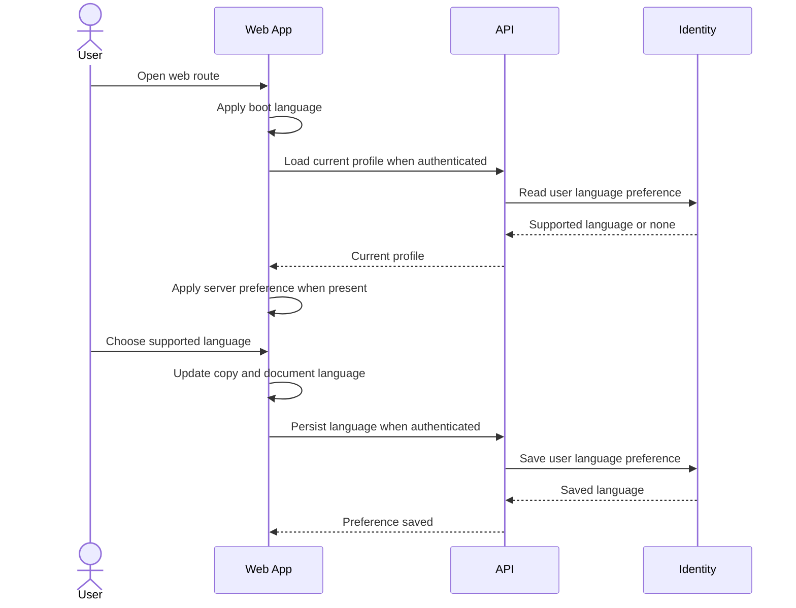

# Select Site Language

> **Navigation**: [docs/use-cases/site-experience/README.md](./README.md) · [docs/use-cases/README.md](../README.md) · [docs/README.md](../../README.md) · [AGENTS.md](../../../AGENTS.md)

## Purpose

Let a visitor or authenticated user view supported web surfaces in a supported language, with authenticated choices persisted as a user-level profile preference.

## Primary actor

- Visitor or authenticated user

## Trigger

- User opens any web route.
- User changes the site language from a language control.

## Main flow

1. User opens a web route.
2. System applies an initial supported language before React renders, using saved browser preference when present, then browser language, then the product fallback language.
3. If the user is authenticated, system loads the Identity-owned user profile language preference.
4. If the authenticated profile has a supported language preference, system applies that server value and mirrors it to browser storage for the next page load.
5. User opens the language control and chooses a supported language.
6. System applies the selected language immediately, updates document language metadata, preserves the current route and in-progress form state, and saves the browser preference.
7. If the user is authenticated, system persists the selected language as the Identity-owned user profile language preference.
8. User continues using the web app in the selected language.

## Alternate / error flows

- Saved browser preference is missing, unsupported, or unreadable: ignore it and continue with browser language or the product fallback language.
- Browser language does not map to a supported language: use the product fallback language.
- Authenticated profile language is missing: keep the current resolved language until the user explicitly chooses a language while authenticated.
- Authenticated profile language is unsupported: ignore it, use the product fallback language, and do not mirror the unsupported value to browser storage.
- Authenticated language persistence fails: keep the current in-browser language usable, show a clear retry state, and do not claim the choice was saved across devices.
- Language profile load fails: keep the current resolved language usable and let the user retry through the normal authenticated surface refresh or language control.

## Acceptance Criteria

*Happy path*
- **AC-001** User can choose a supported language from public auth screens and authenticated app screens.
- **AC-002** A selected language applies immediately without changing route, clearing entered form data, or requiring a full page reload.
- **AC-003** Initial page load resolves a supported language from saved browser preference, then browser language, then the product fallback language.
- **AC-004** Initial page load sets document language metadata before React renders when a supported browser preference is available.
- **AC-005** Authenticated users can persist a supported language as a user-level profile preference owned by the Identity module.
- **AC-006** Authenticated profile reads expose the server-persisted language preference when one exists.
- **AC-007** When an authenticated server preference exists, the frontend treats it as the source of truth and mirrors it to browser storage for the next load.
- **AC-008** Unauthenticated language choice remains a browser preference and does not require an account or API call.
- **AC-009** Supported language values are exactly `en` and `vi`, with `en` as the product fallback.

*Validation & errors*
- **AC-010** Unsupported language values are rejected by authenticated persistence and cannot be selected through the language control.
- **AC-011** Unsupported saved browser values and unsupported server values are ignored instead of applied.
- **AC-012** Authenticated persistence failure shows a clear retry state, keeps the current in-browser language usable, and does not present the preference as saved across devices.
- **AC-013** Authenticated profile load failure keeps the current resolved language usable and does not block public auth flows.
- **AC-014** Storage access failure does not crash the app and falls back to browser language or the product fallback language.

*Edge cases*
- **AC-015** Changing language updates `document.documentElement.lang` to the selected supported language.
- **AC-016** Public auth surfaces, callback recovery states, and authenticated dashboard shell copy render in the selected language for this slice.
- **AC-017** Language preference is user-owned, not workspace-owned; switching or selecting a workspace must not change the persisted language.
- **AC-018** Registration may create the account's initial server language preference from the explicitly selected public site language; sign-in, verification, and callback flows do not silently create or update an existing server language preference.
- **AC-019** Language selection remains available and non-blocking on supported public and authenticated surfaces.

## Acceptance Test Matrix

| ID | Boundary | Scenario | Covers AC | Verification | Required |
|---|---|---|---|---|---|
| AT-001 | Browser journey | Visitor opens a public auth screen, opens the language control without interrupting the form workflow, selects the non-default supported language, reloads, and sees matching copy with document language metadata set | AC-001, AC-002, AC-003, AC-004, AC-008, AC-009, AC-015, AC-016, AC-019 | Browser automation | Yes |
| AT-002 | Browser journey | Authenticated user selects a language, reloads, and the server-persisted profile preference is applied and mirrored to browser storage | AC-005, AC-006, AC-007, AC-015 | Browser automation + API integration test | Yes |
| AT-003 | API boundary | Identity-owned language persistence accepts only supported values, rejects unsupported values, and returns the saved value on profile reads | AC-005, AC-006, AC-009, AC-010 | API integration test | Yes |
| AT-004 | Application boundary | User-level language preference remains independent of workspace selection | AC-005, AC-017 | Application test | Yes |
| AT-005 | UI component | Language control exposes the supported language set, updates copy immediately, preserves route/form state, and satisfies the required UI quality bar | AC-001, AC-002, AC-010, AC-019 | UI component test | Yes |
| AT-006 | UI component | Unsupported or unreadable browser preference falls back without crashing | AC-003, AC-011, AC-014 | UI component test | Yes |
| AT-007 | UI/API boundaries | Authenticated persistence or profile load failure keeps the current language usable and shows retry/recovery state without claiming cross-device save | AC-012, AC-013 | UI component test + API integration test | Yes |
| AT-008 | Browser journey | Registration creates the initial server language preference from the selected public site language, while sign-in, verification, and callback flows do not silently update an existing server language preference | AC-018 | Browser automation + Application test | Yes |

## Out Of Scope

- Translating outbound email or notification content outside registration verification email.
- Server persistence for unauthenticated visitors.
- Workspace-specific language preferences.
- Locale-sensitive date, number, currency, or timezone formatting beyond text copy and document language metadata in this slice.

## Screen flow

| Screen | Required contract |
|---|---|
| App boot | Resolve initial language before React renders from supported browser preference, browser language, or the product fallback language. |
| Public auth screens | Render supported copy in the selected language and allow unauthenticated language selection without an API call. |
| Authenticated app shell | Load server-persisted user language when available, apply it as source of truth, and expose language selection in an authenticated surface. |
| Language persistence state | Show pending, retry, and non-blocking failure states without clearing route or form state. Successful saves do not need a visible confirmation message. |

Required UI quality: language controls must have programmatic labels, keyboard access, focus visibility, visible selected state, stable overlay behavior, and copy that fits in every supported language on supported mobile and desktop viewports.

## Diagrams

### select-site-language-flow

> **Implementation status**
>
> | Layer | Status |
> |-------|--------|
> | Domain | Done |
> | Application | Done |
> | Infrastructure | Done |
> | API | Done |
> | Frontend | Done |
>
> **Implemented:** Identity-owned user language preference, migration-backed persistence, authenticated language preference API, generated frontend API types, boot-time language resolution, public and authenticated language controls, localized copy for public auth, callback recovery, app shell, and dashboard surfaces in this slice, and browser-level authenticated reload evidence that reapplies the server preference after browser language storage is cleared.
>
> **Gaps vs spec:** N/A.
>
> **Deferred follow-ups:** N/A.
>
> **Verification:** Required AT rows are covered by browser automation, UI component tests, API integration tests, application tests, infrastructure tests, and frontend static checks.
>
> **Decisions:** Site Experience owns the web language selection use case. Screen flow owns the product screen contract; Required UI quality owns accessibility and interaction expectations. Identity owns authenticated user language persistence because the preference belongs to the user profile, not workspace-scoped or shared platform state. Server preference is the authenticated source of truth when present; browser preference supports bootstrapping and unauthenticated use. Protected route session bootstrap is owned by [docs/use-cases/identity-access/sign-in-user.md](../identity-access/sign-in-user.md); this use case relies on it only to reload an authenticated language preference journey. Registration may create the initial server preference from an explicit public language selection; later authentication flows must not silently write server language preference.
