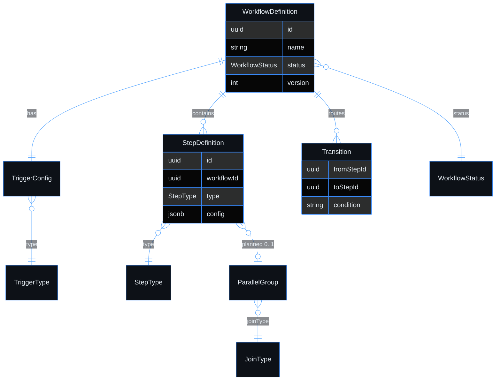

# Use case — Create a workflow

> **Navigation**: [← Workflow Builder](../README.md) · [Use cases index](../README.md#use-cases)

## Purpose

Create a new workflow so that I can start designing an automated process.

## Primary actor

- Tenant Member with `workflow:definition:write`

## Trigger

- User initiates: create a new workflow

## Main flow

1. Member opens the workflow list and starts a new workflow from the create action.
2. System validates the name and plan limit, creates a Draft workflow with Start and End nodes, and persists it for the Tenant.
3. Member lands in the canvas editor for the new Draft workflow and can continue adding steps.

## Alternate / error flows

- Validation failures and edge cases in Acceptance Criteria.

## Context

Users can create, view, edit, publish, archive, delete, and duplicate workflow definitions. A workflow definition is the blueprint the execution engine follows when triggered.

## Acceptance Criteria

*Happy path*
- [ ] Creation dialog collects: name (required), description (optional).
- [ ] New workflow is created in `Draft` status and opens in the visual canvas editor.
- [ ] A new workflow starts with a Start node and an End node already placed on the canvas.

*Validation & errors*
- [ ] Name: required, 2–200 characters, unique within the tenant (case-insensitive). Duplicate shows: "A workflow named '{name}' already exists."
- [ ] If the plan's workflow limit is reached, creation is blocked with an HTTP 402 upgrade prompt.

*Edge cases*
- [ ] Creating a workflow and immediately navigating away without adding any steps: the empty workflow is saved in Draft status and can be returned to later.

*Out of scope*
- Workflow templates / starter library.

> **Implementation status**
>
> | Layer | Status |
> |-------|--------|
> | Domain | ✅ |
> | Application | ✅ |
> | Infrastructure | ✅ |
> | API | ✅ |
> | Frontend | ⏳ |
>
> **Gaps vs spec:** canvas/list UI only (backend).
>
> **Deferred follow-ups:** Workflow templates / starter library.
>
> **Done:** HTTP 402 on create when workflow plan limit reached (`CreateWorkflowHandler` + platform-foundation subscription plans).
>
> **Decisions:**
> - new workflow initialised with Start + End nodes by domain factory
> - all data stored in single `workflow_definitions` table.
>
> **Gaps vs spec:**
> - N/A
>
> **Deferred follow-ups:**
> - N/A

## Wireframes

| Screen | Excalidraw | Preview |
|--------|------------|---------|
| N/A | N/A | N/A |

## Diagrams

### workflow-model

