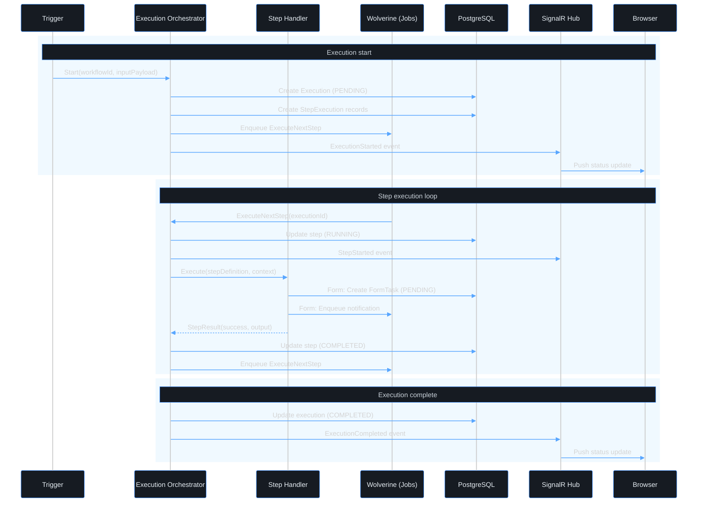

# Use case — Start a workflow execution

> **Navigation**: [← Workflow Engine](../README.md) · [Use cases index](../README.md#use-cases)

## Purpose

Start a workflow execution so that the defined process begins running.

## Primary actor

- user or system

## Trigger

- User initiates: start a workflow execution

## Main flow

1. Actor satisfies the trigger.
2. System performs the happy-path steps in Acceptance Criteria.
3. Actor receives the expected outcome.

## Alternate / error flows

- Validation failures and edge cases in Acceptance Criteria.

## Context

The engine manages the full lifecycle of a workflow execution — from creation through completion, failure, or cancellation. Each execution is a runtime instance of a workflow definition.

## Acceptance Criteria

*Happy path*
- [ ] All trigger types (Manual, Schedule, Webhook, Event) create an Execution record with status `PENDING` before any step runs.
- [ ] The execution ID is returned to the caller immediately (for Manual and Webhook triggers); execution proceeds asynchronously.
- [ ] The engine loads the workflow definition at the moment of trigger (not at publish time) to pick up the latest published version.
- [ ] Within 5 seconds of trigger, the first step begins executing and the execution status transitions to `RUNNING`.

*Validation & errors*
- [ ] Attempting to trigger an Archived or Draft workflow returns HTTP 422: "This workflow cannot be triggered. Status: {status}."
- [ ] If the workflow has no configured trigger matching the incoming trigger type, the request is rejected with HTTP 422.
- [ ] If the required input variables for a Manual trigger are missing, the trigger is rejected with HTTP 422 and structured field errors.

*Edge cases*
- [ ] If the engine crashes between creating the Execution record (PENDING) and starting the first step, a recovery job detects stale PENDING executions (older than 60 seconds) and retries or marks them as Failed.
- [ ] A workflow triggered multiple times in rapid succession creates independent executions; there is no implicit deduplication except for Schedule triggers (see max_concurrent_runs).

*Out of scope*
- Triggering a specific version of a workflow (other than the current active version).

> **Implementation status**
>
> | Layer | Status |
> |-------|--------|
> | Domain | ✅ |
> | Application | ✅ |
> | Infrastructure | ✅ |
> | API | ⏳ |
> | Frontend | ⏳ |
>
> **Gaps vs spec:** trigger HTTP endpoint, schedule/webhook/event trigger handlers, stale-PENDING recovery job pending API + workflow-engine engine.
>
> **Decisions:** `WorkflowExecution.Create` sets status `Pending`; `Start()` transitions to `Running` — engine calls both in sequence.

## Wireframes

| Screen | Excalidraw | Preview |
|--------|------------|---------|
| N/A | N/A | N/A |

## Diagrams

### execution-flow

